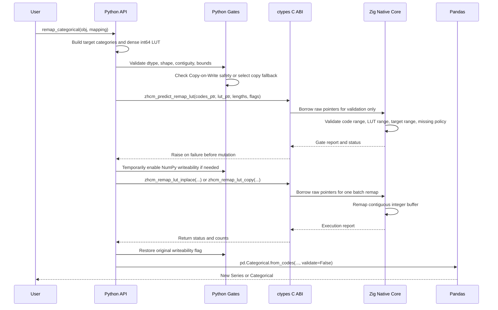

# zh_catmut Architecture

`zh_catmut` is split into a Python safety layer and a Zig native remapping core. The boundary between them is a strict C ABI: Python owns every input and output buffer, while native code receives only raw addresses, integer lengths, primitive flags, and POD report structs.

## Layers

### Python API Layer

The public API lives in `zh_catmut._categorical`:

- `remap_codes_inplace`: low-level NumPy codes remap.
- `remap_categorical`: high-level Pandas categorical remap.

The Python layer performs:

- dtype checks for `np.int8`, `np.int16`, `np.int32`, and `np.int64`;
- one-dimensional and C-contiguous checks;
- `np.int64` LUT checks;
- `size_t`, `int64`, and `uint32` bounds checks;
- temporary NumPy writeability management;
- Pandas Copy-on-Write safety checks for high-level in-place mutation;
- reattachment through `pd.Categorical.from_codes(..., validate=False)`.

### Loader Layer

The loader resolves the bundled platform library through `importlib.resources`:

- Linux: `libzh_catmut.so`
- macOS: `libzh_catmut.dylib`
- Windows: `zh_catmut.dll`

It uses `ctypes.CDLL`, declares exact `argtypes` and `restype` values, then verifies `zhcm_abi_version() == 1`.

### Native Core

The native core is implemented in Zig and exports stable C symbols:

- `zhcm_abi_version`
- `zhcm_status_message`
- `zhcm_predict_remap_lut`
- `zhcm_remap_lut_inplace`
- `zhcm_remap_lut_copy`

The hot operation is dense LUT remapping:

```text
if old_code == missing_code:
    preserve missing_code
else:
    new_code = lut[old_code]
```

The native core supports signed integer code buffers with physical dtypes `int8`, `int16`, `int32`, and `int64`.

## C-ABI Boundary

The boundary deliberately excludes Python objects, Pandas objects, NumPy object arrays, strings, dictionaries, JSON, and serialized payloads. Category labels never cross into native code.

Native functions receive:

- `void *` or `const void *` pointers for code buffers;
- `int64_t *` pointer for the dense LUT;
- `uintptr_t` lengths;
- integer dtype IDs;
- primitive flags;
- caller-allocated report structs.

Native code never:

- stores borrowed pointers after return;
- frees Python-owned buffers;
- allocates output buffers;
- calls the Python C API;
- writes outside the logical element count.

## Validation and Mutation Flow



## Memory Ownership

V1 is Python-owned-buffer-only:

- In-place remap mutates `codes[0:item_count]`.
- Copy remap reads `src_codes[0:item_count]` and writes `dst_codes[0:item_count]`.
- The destination buffer for copy fallback is allocated by Python with `np.empty_like`.
- The native library does not allocate heap memory for output and therefore has no native output ownership to clean up.

Deterministic cleanup happens at the Python boundary:

- temporary writeability changes are restored in `finally`;
- `ctypes` calls keep Python arrays referenced until return;
- borrowed native pointers expire when the native function returns;
- the loader keeps its resource `ExitStack` alive for the process lifetime of the loaded shared library.

## Copy-on-Write Strategy

`remap_categorical` defaults to safety. It rejects high-level in-place mutation when the codes buffer is not owned or when Pandas block reference tracking indicates shared storage.

Two opt-in paths exist:

- `copy_fallback=True`: allocate a destination NumPy buffer and call `zhcm_remap_lut_copy`, preserving the original source buffer.
- `assume_unique=True`: allow in-place mutation after dtype, shape, range, and native validation gates pass.

## Error Model

Python-side gate failures raise `MemoryGateError` or `CopyOnWriteSafetyError`.

Native failures return stable integer status codes and are converted to `NativeStatusError`. Reports include invalid input/output counts and the first invalid index/code pair when applicable.

## Packaging

`setup.py` invokes `zig build --release=fast`, copies the generated shared library into the Python package directory, and includes platform library names as package data. End users load the bundled binary through normal Python imports; no native compiler is required when installing a prebuilt wheel.
